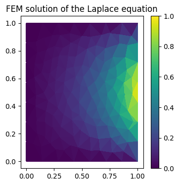
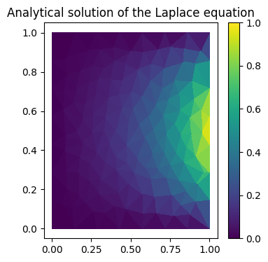
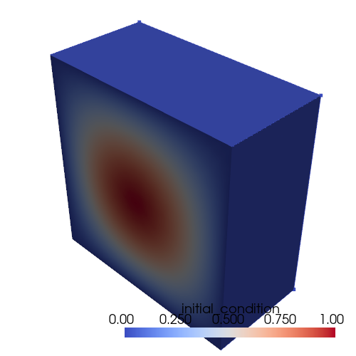
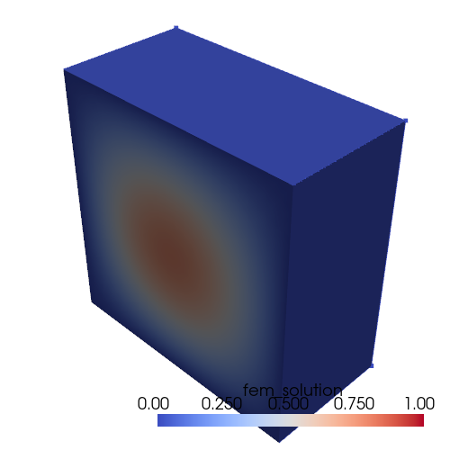
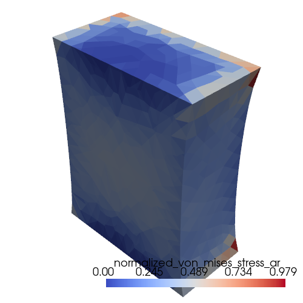

# Finite Element Method from Scratch


What better way to learn how Finite Element Solvers work than implement them from scratch! This repo contains different implementations of the Finite Element Method (FEM). In every examples presented we will use first order Lagrange elements for the sake of simplicity. 

## Garlekin Method on the 2D Laplace Equation

We start by something easy: Solve the 2D Laplace equation with Dirichlet boundary consitions on a flat domain discretized by trianguation. The equation and boundary conditions read:

$$
\begin{aligned}
\nabla^2 u &= 0 && \text{in } \Omega, \\
u &= g(x,y) && \text{on } \partial\Omega.
\end{aligned}
$$

We will solve this equation using the Garlekin method of weighted residuals. The weak form of the Laplace equation is given by:

$$
\int_{\Omega} \nabla^2 u v \; d\Omega = 0
$$

where the test function satisfies

$$
v = 0 \quad \text{on } \partial\Omega.
$$

After applying Green's first identity, we get:

$$
\int_{\Omega} \nabla u \cdot \nabla v\; d\Omega - \int_{\partial \Omega} \nabla u \cdot n v \; d\partial \Omega = 0
$$

Because of the vanishing test function on the boundaries, this simplifies to:

$$
\int_{\Omega} \nabla u \cdot \nabla v \; d\Omega = 0
$$

The boundary conditions is enforced by setting

$$
u = g(x,y) \quad \text{on } \partial\Omega.
$$

To interpolate $u$ in our triangular elements, we will use a first order Lagrange basis function. The basis functions in the element are given by:

$$
\begin{aligned}
\phi_1(u,v) &= u \\
\phi_2(u,v) &= v \\
\phi_3(u,v) &= 1-u-v \\
\end{aligned}
$$

Where the barycentric coordinates of a point in the element satisfy

$$
w = 1 - u - v.
$$

We then use the Garlekin method to obtain the discrete equations. The steps are as follows:

We introduce the finite element approximation

$$
u_h(x) = \sum_j U_j\,\phi_j(x)
$$

and choose Galerkin test functions

$$
v = \phi_i.
$$

Substituting and exchanging sum and integral gives

$$
\sum_j U_j\int_{\Omega} \nabla\phi_j\cdot\nabla\phi_i\,d\Omega = 0.
$$

We then define the stiffness matrix entries

$$
K_{ij} = \int_{\Omega} \nabla\phi_j\cdot\nabla\phi_i\,d\Omega.
$$

So the discrete equations are

$$
\sum_j K_{ij}U_j = 0\qquad\text{for all }i.
$$
  
We then enforce Dirichlet boundary values by splitting unknowns into interior and boundary nodes. Writing the system for interior test indices yields

$$
\sum_{j\in I} K_{ij}U_j = -\sum_{j\in B} K_{ij}g_j,\qquad i\in I,
$$

which is the reduced linear system

$$
K_{II}U_I = F_I,\quad F_I = -K_{IB}g_B,
$$

solved for the interior coefficients $U_I$ and then reconstructed with

$$
U_B = g_B.
$$

Element contribution (triangle mapping): with reference gradients

$$
\nabla_{\xi}\widehat\phi
$$

and Jacobian

$$
J = \partial x / \partial\xi,
$$

$$
K^e_{mn}=\int_T\nabla\phi_m\cdot\nabla\phi_n\,d\Omega
=\int_{\widehat T} (J^{-T}\nabla_{\xi}\widehat\phi_m)\cdot(J^{-T}\nabla_{\xi}\widehat\phi_n)\,|\det J|\,d\xi.
$$

For linear P1 triangles the reference gradients are constant so this reduces to

$$
K^e_{mn}=\tfrac12\,|\det J|\;\big((J^{-T}\nabla_{\xi}\widehat\phi_m)\cdot(J^{-T}\nabla_{\xi}\widehat\phi_n)\big),
$$

which is the explicit form used in the implementation, with the area factor $1/2$ from the reference triangle times $|\det J|$ and the dot product of transformed gradients. Assembly, boundary enforcement and solution follow as described above.

Below are the computed FEM solution and the analytical solution displayed
side-by-side for comparison.

<p align="center">
	
	
</p>

## Garlekin Method on the 3D Heat Equation

The goal is now to solve the heat equation with no-flux (Neumann) boundary conditions in 3D on the unit cube domain using the finite element method. The strong form is

$$
\frac{\partial u}{\partial t} = c\,\Delta u \quad\text{on }\Omega,
$$

where $\Omega$ is the domain and $c$ is a constant diffusion coefficient.

The homogeneous Neumann boundary condition reads

$$
\nabla u \cdot \hat{n} = 0 \quad\text{on }\Gamma,
$$

where $\Gamma=\partial\Omega$ and $\hat{n}$ is the outward normal.

Applying the Galerkin weighted-residual approach with test function $\phi_j$ gives the weak form

$$
\int_{\Omega} \frac{\partial u}{\partial t}\,\phi_j\,d\Omega - c\int_{\Omega} \Delta u\,\phi_j\,d\Omega = 0.
$$

Using Green's identity (integration by parts) the spatial operator becomes

$$
\int_{\Omega} \frac{\partial u}{\partial t}\,\phi_j\,d\Omega + c\int_{\Omega} \nabla u\cdot\nabla\phi_j\,d\Omega = \int_{\Gamma} \phi_j\,\nabla u\cdot\hat{n}\,d\Gamma.
$$

Expanding the solution in the finite element basis

$$
u(t,x)=\sum_i\alpha_i(t)\,\phi_i(x)
$$

and substituting into the weak form produces the semi-discrete system

$$
\sum_i \frac{d\alpha_i}{dt} \int_{\Omega} \phi_i\phi_j\,d\Omega
\; +\; c\sum_i \alpha_i \int_{\Omega} \nabla\phi_i\cdot\nabla\phi_j\,d\Omega
=\; \int_{\Gamma} \phi_j\,\nabla u\cdot\hat{n}\,d\Gamma.
$$

In matrix form this reads

$$
M\,\frac{d\vec{\alpha}}{dt} + c\,K\,\vec{\alpha} = c\,\vec{b},
$$

where $M$ is the mass matrix, $K$ the stiffness matrix and $\vec{b}$ the boundary contribution. Using the backward Euler time integrator with timestep $h$ gives the linear system for each timestep:

$$
M\frac{\vec{\alpha}^{\,n+1}-\vec{\alpha}^{\,n}}{h} + cK\vec{\alpha}^{\,n+1} = c\vec{b}
$$

or equivalently

$$
\bigl[M + c h K\bigr]\,\vec{\alpha}^{\,n+1} = M\,\vec{\alpha}^{\,n} + c h\,\vec{b}.
$$

With homogeneous Neumann boundary conditions the boundary term vanishes and the timestep solve reduces to

$$
\bigl[M + c h K\bigr]\,\vec{\alpha}^{\,n+1} = M\,\vec{\alpha}^{\,n}.
$$

<p align="center">
	
	
</p>
Fem solution and analytical solution for the 3D heat equation with homogeneous Neumann boundary conditions on the unit cube domain. 

## Hamiltonian approach for linear elastic solids


Okay now things are getting fun. The first few examples were a nice warm up for what follows. The goal is now to solve for the displacement field of a linear elastic solid under a given load. Instead of employing the Garlekin method of weighted residuals, we will use this time the hamiltonian principle of stationary action: 

The action functional is given by:

$$
S = \int_{t_0}^{t_f} L(q, \dot{q}) dt
$$

The Lagrangian of the system is

$$
L = T - V.
$$

Here $V$ is the potential energy of the system, $T$ is the kinetic energy of the system, $q$ is the generalized coordinate of the system, and $\dot{q}$ is the generalized velocity of the system.

The stationary action principle states that the true motion of the system is such that the action is stationary, i.e. the variation of the action is zero:

$$
\delta S = 0
$$

By applying the calculus of variations to the action, the equations of motion for the system are derived. This leads to the Euler-Lagrange equations:

$$
\frac{d}{dt} \left( \frac{\partial L}{\partial \dot{q}} \right) - \frac{\partial L}{\partial q} = 0
$$

The first step of this approach is to derive the Lagrangian of the system. 

### State variables interpolation

The displacement field as well as the stress and strain fields are linearly interpolated in the mesh elements (tetrahedra in this case) based on the values at the element nodes. The position inside an element can be defined based on the position of the element nodes and the barycentric coordinates of the point inside the element. This gives 
the following relationship: 

$$
X = \phi_0(X) X_0 + \phi_1(X) X_1 + \phi_2(X) X_2 + \phi_3(X) X_3
$$

Here $X$ denotes the position of a point in the reference/underformed geometry. The position of the same point in the deformed geometry is denoted by $x(X)$. The functions $\phi_i(X)$ are the barycentric coordinates of the point $X$ inside the element. This interpolation given above is also valid for any function such as the position in the deformed geometry $x(X)$, the displacement field $u(X)$, the strain field $\varepsilon(X)$, the stress field $\sigma(X)$, etc. 


We can rewrite the above equation into a matrix vector form: 

$$
X = 
\begin{bmatrix}
\mid& \mid&  \mid& \mid  \\
X_0&  X_1&  X_2&  X_3 \\
\mid&  \mid&  \mid& \mid \\
\end{bmatrix}  
\begin{bmatrix}
\phi_0(X)\\
\phi_1(X)\\
\phi_2(X)\\
\phi_3(X)\\
\end{bmatrix}
$$

This system is not solvable, but with the fact that the sum of the barycentric coordinates is always equal to 1, we can rewrite the above equation as:

$$
X - X_0 = 
\underbrace{
\begin{bmatrix}
\mid& \mid&  \mid \\
X_1 - X_0&  X_2- X_0&  X_3- X_0 \\
\mid&  \mid&  \mid&\\
\end{bmatrix}}_{=\;T}
\begin{bmatrix}
\phi_1(X)\\
\phi_2(X)\\
\phi_3(X)\\
\end{bmatrix}
$$

and 

$$
\phi_0(X) = 1 - \phi_1(X) - \phi_2(X) - \phi_3(X)
$$


we can therefore write that

$$
\begin{bmatrix}
\phi_1(X)\\
\phi_2(X)\\
\phi_3(X)\\
\end{bmatrix} = 
T^{-1} (X - X_0)
$$

and 

$$
\phi_0(X) = 1 - \vec{1}^T T^{-1} (X - X_0)
$$

where $\vec{1}$ is a vector of ones.

Assembling everything together, we obtain the following expression for the barycetric position of a point inside an element:


$$
\begin{bmatrix}
\phi_0(X)\\
\phi_1(X)\\
\phi_2(X)\\
\phi_3(X)\\
\end{bmatrix} =  
\begin{bmatrix}
1\\
0\\
0\\
0\\
\end{bmatrix} 
+
\underbrace{
\begin{bmatrix}
& & & -\vec{1}^{T} \; T^{-1} & & & \\
-&-&-&-&-&-& \\
& & & & & & \\
& & &T^{-1}& & & \\
& & & & & & \\
\end{bmatrix}}_{=D \;(4 \times 3)}
\underbrace{
(X - X_0)}_{(3 \times 1)}
$$

The position in the deformed geometry is given by:

$$
x(X) = \underbrace{
\begin{bmatrix}
\mid& \mid&  \mid& \mid  \\
x_0&  x_1&  x_2&  x_3 \\
\mid&  \mid&  \mid& \mid \\
\end{bmatrix}}_{(3 \times 4)} \cdot
\begin{bmatrix}
\phi_0(X)\\
\phi_1(X)\\
\phi_2(X)\\
\phi_3(X)\\
\end{bmatrix}
$$

$$
x(X) = \vec{x_0} +
\underbrace{
\begin{bmatrix}
\mid& \mid&  \mid& \mid  \\
x_0&  x_1&  x_2&  x_3 \\
\mid&  \mid&  \mid& \mid \\
\end{bmatrix}}_{(3 \times 4)} 
\underbrace{
\begin{bmatrix}
& & & -\vec{1}^{T} \; T^{-1} & & & \\
-&-&-&-&-&-& \\
& & & & & & \\
& & &T^{-1}& & & \\
& & & & & & \\
\end{bmatrix}}_{=D \; (4 \times 3)}
\underbrace{
(X - X_0)}_{(3 \times 1)}
$$

This equation is pretty useful as it allows to easily compute the deformation gradient tensor:

$$
F = \underbrace{\frac{\partial}{\partial X} x(X,t)}_{(3 \times 3)} = \underbrace{
\begin{bmatrix}
 \mid& \mid&  \mid& \mid  \\
 x_0&  x_1&  x_2&  x_3 \\
 \mid&  \mid&  \mid& \mid \\
\end{bmatrix}}_{(3 \times 4)} 
\underbrace{
\begin{bmatrix}
& & & -\vec{1}^{T} \; T^{-1} & & & \\
-&-&-&-&-&-& \\
& & & & & & \\
& & &T^{-1}& & & \\
& & & & & & \\
\end{bmatrix}}_{=D \; (4 \times 3)}
$$


### Kinetic energy

The kinetic energy of the system is given by:

$$
T = \sum_{i=1}^{N} \frac{1}{2} \int_{\Omega_{i,0}} \dot{q}(t, X)^T \, \dot{q}(t, X) \; d\Omega_{i,0}
$$

Where the sum runs over all the element cells of the mesh (tetrahedra in this case). $q(X,t)$ is the generalized coordinate of the system. In this case, the generalized coordinate is the displacement field $u(X,t)$. The dot denotes the time derivative. Note that the kinetic energy of the system is computed in the reference configuration (Lagrangian formulation).

For each element, we can write the displacement of a given point as: 

$$
u(X,t) = 
\underbrace{
\begin{bmatrix}
& & & \\
\mathrm{I}\phi_0(X) & \mathrm{I}\phi_1(X) & \mathrm{I}\phi_2(X) & \mathrm{I}\phi_3(X)\\
& & & \\
\end{bmatrix}}_{= N(X) \; (3 \times 12)}
\underbrace{
\begin{bmatrix}
\mid \\
u_0(t) \\
\mid \\
\\
\mid\\
u_1(t) \\
\mid \\
... \\
\end{bmatrix}}_{=u(t) \; (1 \times 12)}
$$

The kinetic energy of the system is therefore given by:

$$
\sum_{i=1}^{N} \frac{1}{2} \dot{u}(t)^{T} \underbrace{\int_{\Omega_{i,0}} N(X)^T  N(X) \, d\Omega_{i,0}}_{= \mathrm{M}_0 (12 \times 12)} \; \dot{u}(t)
$$


Where $\mathrm{M}_0$ is the local mass matrix of the system: 

$$
\mathrm{M}_0 = 
\int_{\Omega_{i,0}}
\begin{bmatrix}
\mathrm{I} \phi_0(X) \phi_0(X) & \mathrm{I} \phi_0(X) \phi_1(X) & \mathrm{I} \phi_0(X) \phi_2(X) & \mathrm{I} \phi_0(X) \phi_3(X) \\
\mathrm{I} \phi_1(X) \phi_0(X) & \mathrm{I} \phi_1(X) \phi_1(X) & \mathrm{I} \phi_1(X) \phi_2(X) & \mathrm{I} \phi_1(X) \phi_3(X) \\
\mathrm{I} \phi_2(X) \phi_0(X) & \mathrm{I} \phi_2(X) \phi_1(X) & \mathrm{I} \phi_2(X) \phi_2(X) & \mathrm{I} \phi_2(X) \phi_3(X) \\
\mathrm{I} \phi_3(X) \phi_0(X) & \mathrm{I} \phi_3(X) \phi_1(X) & \mathrm{I} \phi_3(X) \phi_2(X) & \mathrm{I} \phi_3(X) \phi_3(X) \\
\end{bmatrix} d\Omega_{i,0}
$$

This local mass matrix can be computed like done in the previous notebooks by numerically integrating the shape functions in a reference element and then transforming the region of integration. The global matrix can also be assembled in a similar way as done in the previous notebooks.

### Potential energy: Strain Density Energy

The potential energy of the system in Lagrangian form is given by:

$$
V = \sum_{i=1}^{N} \frac{1}{2} 
\int_{\Omega_{i,0}} \Psi(\mathrm{E}) \, d\Omega_{i,0} -
\int_{\Omega_{i,0}} f \cdot u \, d\Omega_{i,0} -
\int_{\partial\Omega_{i,0}} t \cdot u \, d\partial\Omega_{i,0}
$$

$\Psi$ and $E$ are respectively the strain energy density function and the Green-Lagrange strain tensor of the system. $f$ is the body force acting on the system and $t$ is the traction force acting on the system. $u$ is the displacement field of the system.
$\partial \Omega_{i,0}$ denotes the boundary of the element cell $\Omega_{i,0}$.

For an isotropic linear elastic material, the strain energy density function in Lagrangian formulation is given by:

$$
\Psi(\epsilon) = \frac{1}{2} \mathrm{S} : \mathrm{E} 
$$

Where $\mathrm{S}$ is the second Piola-Kirchhoff stress tensor. And 
$:$ is the double contraction operation: 

$$
A:B = A_{1,1} B_{1,1} + A_{1,2} B_{1,2} + ... + A_{3,3} B_{3,3}
$$


The second Piola-Kirchhoff stress tensor is related to the Cauchy stress tensor ($\sigma$) by:

$$
S = J \mathrm{F}^{-1} \sigma \mathrm{F}^{-T}
$$

Where $J$ is the determinant of the deformation gradient tensor $\mathrm{F}$.

In tensor form, S is for an isotropic linear elastic material given by:

$$
S = \lambda \mathrm{tr}(\mathrm{E}) \mathrm{I} + 2 \mu \mathrm{E}
$$

The 6 independent components of S can also be computed as a matrix vector product:

$$
\begin{bmatrix}
S_{11} \\
S_{22} \\
S_{33} \\
S_{12} \\
S_{23} \\
S_{13} \\
\end{bmatrix} =
\underbrace{
\begin{bmatrix}
\lambda + 2 \mu & \lambda & \lambda & 0 & 0 & 0 \\
\lambda & \lambda + 2 \mu & \lambda & 0 & 0 & 0 \\
\lambda & \lambda & \lambda + 2 \mu & 0 & 0 & 0 \\
0 & 0 & 0 & \mu & 0 & 0 \\
0 & 0 & 0 & 0 & \mu & 0 \\
0 & 0 & 0 & 0 & 0 & \mu \\
\end{bmatrix}}_{= \mathrm{C} \; (6 \times 6)}
\begin{bmatrix}
E_{11} \\
E_{22} \\
E_{33} \\
2 E_{12} \\
2 E_{23} \\
2 E_{13} \\
\end{bmatrix}
$$

Where $\lambda$ and $\mu$ (shear modulus) are the Lamé parameters of the material. $\mathrm{I}$ is the identity tensor and $\mathrm{tr}$ is the trace operator. Note that the first Lame parameters can be obtained from the Young's modulus and the Poisson's ratio of the material: 

$$
\lambda = \frac{E \nu}{(1+\nu)(1-2\nu)}
$$

$$
\mu = \frac{E}{2(1+\nu)} 
$$

The strain density function in this case can therefore simply be written as:

$$
\Psi(\mathrm{E}) = \frac{1}{2} \mathrm{S} : \mathrm{E} = \frac{1}{2} \vec{\mathrm{E}}^T \mathrm{C} \vec{\mathrm{E}}
$$

In the limit of small strain: $\mathrm{E} \approx \frac{1}{2}(\nabla_X u + \nabla_X u^T)$, the element of the strain tensor can directly be obtained from the derivative of the displacement field:

$$
\begin{align}
E_{11} &= \frac{\partial u_1}{\partial X_1} \\
E_{22} &= \frac{\partial u_2}{\partial X_2} \\
E_{33} &= \frac{\partial u_3}{\partial X_3} \\
E_{12} &= \frac{1}{2} \left( \frac{\partial u_1}{\partial X_2} + \frac{\partial u_2}{\partial X_1} \right) \\
E_{23} &= \frac{1}{2} \left( \frac{\partial u_2}{\partial X_3} + \frac{\partial u_3}{\partial X_2} \right) \\
E_{13} &= \frac{1}{2} \left( \frac{\partial u_1}{\partial X_3} + \frac{\partial u_3}{\partial X_1} \right) \\
\end{align}
$$

This can be written in matrix form as:

$$
\begin{bmatrix}
E_{11} \\
E_{22} \\
E_{33} \\
2 E_{12} \\
2 E_{23} \\
2 E_{13} \\
\end{bmatrix} =
\underbrace{
\begin{bmatrix}
\frac{\partial}{\partial X_1} & 0 & 0 \\
0 & \frac{\partial}{\partial X_2} & 0 \\
0 & 0 & \frac{\partial}{\partial X_3} \\
\frac{\partial}{\partial X_2} & \frac{\partial}{\partial X_1} & 0 \\
0 & \frac{\partial}{\partial X_3} & \frac{\partial}{\partial X_2} \\
\frac{\partial}{\partial X_3} &  0 & \frac{\partial}{\partial X_1} \\
\end{bmatrix}}_{= B \; (6 \times 3)}
\;
u(X,t) = 
B \; 
\underbrace{
\begin{bmatrix}
I \phi_0(X_1, X_2, X_3) & I \phi_1(X_1, X_2, X_3) & I \phi_2(X_1, X_2, X_3) & I \phi_3(X_1, X_2, X_3) \\
\end{bmatrix}}_{=N(X) \; (3 \times 12)}  \;
\underbrace{
\begin{bmatrix}
\mid \\
u_0(t) \\
\mid \\
 \\
\mid\\
u_1(t) \\
\mid \\
... \\
\end{bmatrix}}_{=u(t) \; (12 \times 1)}
$$

$$
\begin{bmatrix}
E_{11} \\
E_{22} \\
E_{33} \\
2 E_{12} \\
2 E_{23} \\
2 E_{13} \\
\end{bmatrix} = B \; N(X) \; u(t) = 
\underbrace{
\begin{bmatrix}
\partial_{X_1} \phi_0& 0& 0& \partial_{X_1} \phi_1& 0& 0& \partial_{X_1} \phi_2& 0& 0& \partial_{X_1} \phi_3& 0& 0 \\
0& \partial_{X_2} \phi_0& 0& 0& \partial_{X_2} \phi_1& 0& 0& \partial_{X_2} \phi_2& 0& 0& \partial_{X_2} \phi_3 & 0 \\
0& 0& \partial_{X_3} \phi_0& 0& 0& \partial_{X_3} \phi_1& 0& 0& \partial_{X_3} \phi_2& 0& 0& \partial_{X_3} \phi_3 \\
\partial_{X_2} \phi_0& \partial_{X_1} \phi_0& 0& \partial_{X_2} \phi_1& \partial_{X_1} \phi_1& 0& \partial_{X_2} \phi_2& \partial_{X_1} \phi_2& 0& \partial_{X_2} \phi_3 & \partial_{X_1} \phi_3& 0 \\
0& \partial_{X_3} \phi_0& \partial_{X_2} \phi_0& 0& \partial_{X_3} \phi_1& \partial_{X_2} \phi_1& 0& \partial_{X_3} \phi_2& \partial_{X_2} \phi_2& 0& \partial_{X_3} \phi_3& \partial_{X_2} \phi_3  \\
\partial_{X_3} \phi_0& 0& \partial_{X_1} \phi_0& \partial_{X_3} \phi_1& 0& \partial_{X_1} \phi_1& \partial_{X_3} \phi_2& 0& \partial_{X_1} \phi_2& \partial_{X_3} \phi_3& 0& \partial_{X_1} \phi_3 \\
\end{bmatrix}}_{=\Gamma (6 \times 12)} \; u(t) 
$$

To create the $\Gamma$ matrix, it is pretty convenient to start by forming the following matrix:

$$
\begin{bmatrix}
\partial_{X_1} \phi_0& \partial_{X_2} \phi_0& \partial_{X_3} \phi_0 \\
\partial_{X_1} \phi_1& \partial_{X_2} \phi_1& \partial_{X_3} \phi_1 \\
\partial_{X_1} \phi_2& \partial_{X_2} \phi_2& \partial_{X_3} \phi_2 \\
\partial_{X_1} \phi_3& \partial_{X_2} \phi_3& \partial_{X_3} \phi_3 \\
\end{bmatrix} = 
\begin{bmatrix}
\phi_0(X_1, X_2, X_3) \\
\phi_1(X_1, X_2, X_3) \\
\phi_2(X_1, X_2, X_3) \\
\phi_3(X_1, X_2, X_3) \\
\end{bmatrix}
\cdot
\begin{bmatrix}
\partial_{X_1} & \partial_{X_2} & \partial_{X_3} \\
\end{bmatrix} =
\underbrace{
\begin{bmatrix}
& & & -\vec{1}^{T} \; T^{-1} & & & \\
-&-&-&-&-&-& \\
& & & & & & \\
& & &T^{-1}& & & \\
& & & & & & \\
\end{bmatrix}}_{=D \;(4 \times 3)}
$$

Since the barycentric coordinate functions are linear with respect to the position in the reference configuration, their derivative are constant. Meaning that the Green-Lagrange tensor
and strain density energy are also constant in the elements. The integral of the strain density energy inside an element is therefore given by:

$$
\int_{\Omega_{i,0}} \Psi(\mathrm{E}) \; d\Omega_{i,0} = \text{Vol}(\Omega_{i,0}) \cdot \Psi(\mathrm{E}) = \text{Vol}(\Omega_{i,0}) \cdot \frac{1}{2} \vec{\mathrm{E}}^T \mathrm{C} \vec{\mathrm{E}} = 
\text{Vol}(\Omega_{i,0}) \cdot \frac{1}{2} u(t)^T \underbrace{\Gamma^T \mathrm{C} \Gamma}_{=K_0 \; (12 \times 12) } u(t)
$$

$K_0$ is the local stiffness matrix of the system. The global stiffness matrix can be assembled in a similar way as done in the previous notebooks.


### Potential energy: Body Forces


The body forces applied to an element of the mesh (gravity, etc.) will be given with respect to the deformed configuration:

$$
\int_{\Omega_{i}} \rho g^T \cdot u(x,t) \; d\Omega_{i}
$$

Where $\rho$ is the density of the material and $g$ is the acceleration due to gravity. Even though the gravity is constant throughout the element, the density between the deformed and reference configuration might not be the same. Because of the conservation of mass, we have that:

$$
\int_{\Omega_{i}} \rho g^T \cdot u(x,t) \; d\Omega_{i} = \int_{\Omega_{i,0}} \rho_0 g^T \cdot u(X,t) \; d\Omega_{i,0} 
$$

Since the displacement field is interpolated as

$$
u(X,t) = N(X)\,u(t),
$$

we can write the above equation as:

$$
\int_{\Omega_{i,0}} \rho_0 g^T \cdot u(X,t) \; d\Omega_{i,0} = \rho_0 \underbrace{g^T}_{(1 \times 12)} \int_{\Omega_{i,0}} 
\underbrace{
\begin{bmatrix}
\mathrm{I}\phi_0(X) & & & \\
& \mathrm{I}\phi_1(X) & & \\
& & \mathrm{I}\phi_2(X) & \\
& & & \mathrm{I}\phi_3(X) \\
\end{bmatrix}}_{=B_\mathrm{local}(X) \; (12 \times 12)} \; u(t) \; d\Omega_{i,0}
\; \underbrace{
\begin{bmatrix}
\mid \\
u_0(t) \\
\mid \\
\\
\mid\\
u_1(t) \\
\mid \\
... \\
\end{bmatrix}}_{=u(t) \; (12 \times 1)}
$$


Since all the calculation are run wrt the reference configuration, the inetgral in the above equation only has to be computed once at the beginning of the simulation. 


### Potential energy: Traction Forces

The traction forces are given at the level of the faces of the mesh in the deformed configuration. Since, we are solving for the displacement with respect to the reference configuration, we need to transform the traction forces to the reference configuration. We first need to rotate the traction forces with respect to the axis orthogonal to the face normals in the deformed and reference configuration. The rotation matrix is given by the Rodrigues formula:

$$
R = \mathrm{I} + \sin(\theta) \cdot \mathrm{K} + (1 - \cos(\theta)) \cdot \mathrm{K}^2
$$

With: 

$$
K = 
\begin{bmatrix}
0 & -k_z & k_y \\
k_z & 0 & -k_x \\
-k_y & k_x & 0 \\
\end{bmatrix}
$$

The rotation axis and angle are

$$
k = n \times N,
\qquad
eta = \arccos(n \cdot N),
$$

where $n$ is the unit normal in the deformed configuration and $N$ is the unit normal in the reference configuration. The traction forces then need to be rescaled based on the difference in area between the deformed and reference configuration. The traction forces in the reference configuration are then given by:

$$
t_0 = \frac{a}{A} R t
$$

Since the normals and traction vectors are constant accross the surface triangles, the integral can be rewritten as: 

$$
\int_{\partial \Omega_{i,0}} t_0^T  u(X,t) \; d\partial \Omega_{i,0} =  \underbrace{t_0^T}_{(1 \times 9)} 
\int_{\partial \Omega_{i,0}}
\underbrace{
\begin{bmatrix}
\mathrm{I}\phi_0(X) & &\\
& \mathrm{I}\phi_1(X) &\\
& & \mathrm{I}\phi_2(X)\\
\end{bmatrix}}_{=S_\mathrm{local}(X) \; (9 \times 9)} \; d\partial \Omega_{i,0} 
\;
\underbrace{
\begin{bmatrix}
\mid \\
u_0(t) \\
\mid \\
 \\
\mid\\
u_1(t) \\
\mid \\
... \\
\end{bmatrix}}_{=u(t) \; (9 \times 1)}
$$


Here is how to integrate the shape functions over the surfaces of the triangles. Let the three points in 3D of a surface triangle be

$$
P_1 = (x_1, y_1, z_1), \quad P_2 = (x_2, y_2, z_2), \quad P_3 = (x_3, y_3, z_3).
$$

​
A convenient way to parametrize the surface is using barycentric coordinates:

$$
R(u,v) = P1 + u(P2 - P1) + v(P3 - P1)
$$

Where $u$ and $v$ are parameters that satisfy

$$
0 \le u \le 1, \qquad 0 \le v \le 1, \qquad u + v \le 1.
$$

If we want to integrate a function $f(x,y,z)$ over the surface, we can substitute $x$, $y$, and $z$ using the parametric form:

$$
\begin{align}
x &= x1 + u(x2 - x1) + v(x3 - x1) \\
y &= y1 + u(y2 - y1) + v(y3 - y1) \\
z &= z1 + u(z2 - z1) + v(z3 - z1) \\
\end{align}
$$

This rewrites the function as $$f(R(u,v))$$.

The surface element is determined by the cross product of the tangent vectors

$$
\frac{\partial R}{\partial u}
\quad\text{and}\quad
\frac{\partial R}{\partial v}.
$$

$$
dA = \left\| \frac{\partial R}{\partial u} \times \frac{\partial R}{\partial v} \right\| \; du dv
$$

Where

$$
\frac{\partial R}{\partial u} = P_2 - P_1,
\qquad
\frac{\partial R}{\partial v} = P_3 - P_1.
$$

The cross product of these two vectors gives the normal vector to the surface:

$$
N = \frac{\partial R}{\partial u} \times \frac{\partial R}{\partial v} = (P2 - P1) \times (P3 - P1)
$$

The differential area element is therefore given by:

$$
dA = \left\| N \right\| du dv
$$

The integral of the function over the surface is then given by:

$$
\int_{\partial \Omega_0} f(x,y,z) \; dA = \left\| N \right\| \int_{0}^{1} \int_{0}^{1-u} f(R(u,v))  \; du dv
$$


In our case, $R(u,v)$ maps the local face coordinates to the global reference coordinates and then the function $f$ is a shape function that maps the global coordinates back to the local face coordinates. The integrand can therefore be replaced by a simpler function $g(u,v)$ that only depends on the local face coordinates, without changing the result of the integral. We note that the shape functions are equal to one at their respective points and then linearly decrease to zero at the other points of the faces:

$$
\begin{align}
g(u = 0, v = 0) &= 1 \\
g(u = 1, v = 0) &= 0 \\
g(u = 0, v = 1) &= 0 \\
\end{align}
$$

We therefore have that: 

$$
g(u,v) = 1 - u - v
$$

The integral to compute becomes:

$$
\int_{\partial \Omega_0} f(x,y,z) \; dA = \left\| N \right\|  \int_{0}^{1} \int_{0}^{1-u} 1 - u - v \; du dv = \frac{1}{6} \left\| N \right\|
$$

Which is equal to : 

$$
\int_{\partial \Omega_0} \phi_i(x,y,z) \; dA = \frac{1}{3} \mathrm{Area}(\partial \Omega_0)
$$


### Derivation and numerical integration of the equations of motion

We now need to solve the Euler-Lagrange equations to find the displacement field of the system. The Euler-Lagrange equations are given by:

$$
\frac{d}{dt} \left( \frac{\partial L}{\partial \dot{u}} \right) - \frac{\partial L}{\partial u} = 0
$$


If we write: 

$$
L =  \frac{1}{2} \dot{u}^T \mathrm{M}_0 \dot{u} - \left( \frac{1}{2} u^T K_e u  + \rho_0 u^T B g + u^T S t_0  \right)
$$

Applying the Euler-Lagrange formula, we obtain the following equation of motion:

$$
\mathrm{M}_0 \ddot{u} + K_e u = \rho_0 B g + S t_0
$$

In the static case, the acceleration is zero and the equation of motion simplifies to:

$$
K_e u = \rho_0 B g + S t_0
$$

We will also assume that the traction forces are zero and the solid is not subject to any body forces. The equation of motion then simplifies to:

$$
K_e u = 0
$$

Here is the result of the simulation for a cube of linear elastic material with a traction force applied on the top face. The cube is fixed at the bottom face. The Von Mises stress is plotted in the deformed configuration. 
<p align="center">
	
</p>


### Dynamic case

We will use the Newmark-beta method to integrate the equations of motions of the dynamic case.  The Newmark-beta method is defined by the following equations:

$$
\begin{align}
u_{n+1} &= u_n + \Delta t \dot{u}_n + \frac{\Delta t^2}{2} \left[ (1 - 2 \beta) \ddot{u}_n + 2 \beta \ddot{u}_{n+1} \right] \\
\dot{u}_{n+1} &= \dot{u}_n + \Delta t \left[ (1 - \gamma) \ddot{u}_n + \gamma \ddot{u}_{n+1} \right] \\
\end{align}
$$

This integration scheme can be made unconditionnaly stable by setting the parameters

$$
\beta = 0.25, \qquad \gamma = 0.5.
$$

We thus obtain the following equations:

$$
\begin{align}
u_{n+1} &= u_n + \Delta t \dot{u}_n + \frac{\Delta t^2}{4} \left[ \ddot{u}_n +  \ddot{u}_{n+1} \right] \\
\dot{u}_{n+1} &= \dot{u}_n + \frac{\Delta t}{2} \left[ \ddot{u}_n + \ddot{u}_{n+1} \right] \\
\end{align}
$$

The equation of motion to solve is (the system is undamped): 

$$
\mathrm{M} \ddot{u}_{n+1} + K_e u_{n+1} = 0
$$

If we substitute $u_{n+1}$ in the above equation, we obtain the following equation to solve:

$$
\mathrm{M} \ddot{u}_{n+1} + K_e \left( u_n + \Delta t \dot{u}_n + \frac{\Delta t^2}{4} \left[ \ddot{u}_n +  \ddot{u}_{n+1} \right] \right) = 0 
$$

$$
\left[\mathrm{M} + \frac{\Delta t^2}{4} K_e \right] \ddot{u}_{n+1} = - K_e \left( u_n + \Delta t \dot{u}_n + \frac{\Delta t^2}{4} \ddot{u}_n \right)
$$

The time step will be choosen based on the young modulus of the elastic solid and the resolution of the mesh. The wave speed of the solid can be approximated by:

$$
c = \sqrt{\frac{E}{\rho}}.
$$

The minimum natural time period of the solid scales with the wave speed and the resolution of the mesh:

$$
T_{\mathrm{min}} = \frac{2 h_{\mathrm{min}}}{ c} = \frac{2 h_{\mathrm{min}}}{\sqrt{E  / \rho}}
$$

Where $h_{\mathrm{min}}$ is the minimum edge length of the mesh. The time step is then choosen as a fraction of the minimum natural time period:

$$
\Delta t = \alpha \frac{2 h_{\mathrm{min}}}{\sqrt{ E / \rho}}
$$

Where $\alpha$ is a constant that can be choosen to be 0.1.

## Hamiltonian approach for non-linear elastic solids

Linear elasticity is fun, but we can all agree I believe that it is not as exciting as non-linear elasticity. In this section, we will derive the equations of motion for a non-linear elastic solid using again the Hamiltonian approach. 

The first steps are the same until the application of the Euler-Lagrange equations. Which gives us the following equation of motion:

$$
\mathrm{M}_0 \ddot{u} + K_e(u) u = \rho_0 B g + S t_0
$$

The main difficulty now is in calculating the potential energy of the function given that the strain energy density function is non-linear. In this example we will use the strain density energy of a compressible Neo-Hookean material, which is given by:

$$
\Psi(F) = C_1 \left(I_1 - 3 - 2 \log(J)\right) + C_2 \left(J - 1\right)^2 
$$

Where $I_1$ is the first invariant of the deformation gradient tensor $F$ and $J$ is the determinant of $F$. The first invariant is given by:

$$
I_1 = \mathrm{tr}(F^TF)
$$

The internal forces due to elasticity are given by the gradient of the strain density energy with respect to the displacement field. Instead of calculating and constructing this function by hand laboriously, we can use the jax library to automatically compute the gradient of the strain density energy with respect to the displacement field. Life is too short to derive the gradient of a non-linear function by hand...

### Jacobian of the internal forces wrt the displacement field

Another quantity that we will compute automatically with Jax is the Jacobian of the internal forces with respect to the displacement field. This matrix will later be essential to solve the non-linear equations of motion. Unfortunately, we cannot simply call `jax.jacobian` on the internal force vector because the matrix thereby created would be dense and would not fit in memory. We already know the sparsity pattern of the jacobian since if two nodes are connected with an edge, then when one of the nodes move it affects the forces of the other one and vice versa. We can take advantage of this known sparsity pattern to only compute certain parts of the jacobian matrix with the `jax.jvp` (jacobian vector product) function and thus create a sparse representation of the jacobian matrix.

If we have the following mesh structure: 
```
A -- B -- C  D
```
where A and B, B and C are connected by an edge and D is not connected to any other node. The jacobian of the forces wrt the node displacements would look like this:

$$
\begin{bmatrix}
\partial F_{A} / \partial u_A & \partial F_{A} / \partial u_B & \partial F_{A} / \partial u_C & \partial F_{A} / \partial u_D \\
\partial F_{B} / \partial u_A & \partial F_{B} / \partial u_B & \partial F_{B} / \partial u_C & \partial F_{B} / \partial u_D \\
\partial F_{C} / \partial u_A & \partial F_{C} / \partial u_B & \partial F_{C} / \partial u_C & \partial F_{C} / \partial u_D \\
\partial F_{D} / \partial u_A & \partial F_{D} / \partial u_B & \partial F_{D} / \partial u_C & \partial F_{D} / \partial u_D \\
\end{bmatrix}
$$

Each entry is a 3 by 3 block because of the 3 dimensions of the displacement field. If we remove the zero entries of the matrix, we get:

$$
\begin{bmatrix}
\partial F_{A} / \partial u_A & \partial F_{A} / \partial u_B & 0                             & 0                             \\
\partial F_{B} / \partial u_A & \partial F_{B} / \partial u_B & \partial F_{B} / \partial u_C & 0                             \\
0                             & \partial F_{C} / \partial u_B & \partial F_{C} / \partial u_C & 0                             \\
0                             & 0                             &  0                            & \partial F_{D} / \partial u_D \\
\end{bmatrix}
$$

Now if we multiply this matrix by the vector

$$
\left[1, 0, 0, 1\right],
$$

we obtain

$$
\left[\partial F_{A} / \partial u_A, \partial F_{B} / \partial u_A, 0, \partial F_{D} / \partial u_D\right].
$$

Then we can do the same for the second and third columns to collect all the non zero entries of the Jacobian matrix. By collecting simultaneously several non-zero entries, we reduce the number of calls to the `jax.jvp` function and thus speed up the computation of the jacobian matrix.

We cannot collect simultaneously the entries corresponding to two points if they are only separated by one or two edges. For instance, if we try to obtain the entries for node A and C with the vector

$$
\left[1, 0, 1, 0\right],
$$

we would obtain the following vector:

$$
\left[\partial F_{A} / \partial u_A, \partial F_{B} / \partial u_A + \partial F_{b} / \partial u_c, \partial F_{C} / \partial u_C, 0\right].
$$

It is impossible to separate the contribution of node A and C on the forces of node B.

The first step is therefore to group the nodes of the mesh in groups where all points are at least separated by two edges. This problem is sometimes called the distance-2 graph coloring problem. We will use a greedy algorithm to solve this problem. 


## Time integration 

To keep things simple, we will use the implicit backward Euler method. The equations of motion are given by:

$$
M \ddot{u} - \vec{K}(u) = 0
$$

Which can be rewritten as a first order system:

$$
\begin{aligned}
\dot{u} &= v \\
M \dot{v} &= \vec{K}(u)
\end{aligned}
$$

To integrate from time step $n$ to time step $n+1$, the implicit method requires to solve the following equation:

$$
\begin{aligned}
u_{n+1} &= u_n + h v_{n+1} \\
M v_{n+1} &= M v_n + h \vec{K}(u_{n+1}) \\
\end{aligned}
$$

We can write this equations into a function $F(\hat{u}, \hat{v})$:

$$
F(\hat{u}, \hat{v}) =
\begin{bmatrix}
\hat{u} - u_n - h \hat{v} \\
M \hat{v} - M v_n - h \vec{K}(\hat{u}) \\
\end{bmatrix}
$$

When this function is equal to zero, then we have found the displacements and velocities at time step $n+1$, i.e.

$$
\hat{u} = u_{n+1}, \qquad \hat{v} = v_{n+1}
$$

if $F(\hat{u}, \hat{v}) = \vec{0}$. We can solve this equation using the Newton-Raphson method. The first step is to
compute a linear approximation of $F$ around the current guess $(\hat{u}, \hat{v})$:

$$
F(\hat{u} + \delta u, \hat{v} + \delta v) \approx F(\hat{u}, \hat{v}) + \mathrm{J}(F) \begin{bmatrix} \delta u \\ \delta v \end{bmatrix}
$$

We replace the right hand side of the equation by zero to find the root of our function $F(\hat{u}, \hat{v})$:

$$
\mathrm{J}(F) \begin{bmatrix} \delta u \\ \delta v \end{bmatrix}= - F(\hat{u}, \hat{v})
$$

The Newton-Raphson algorithm simply boils down to repeating iteratively the above equation until we reach a certain tolerance.

The jacobian of the function $F$ has the following form:

$$
\mathrm{J}(F) =
\begin{bmatrix}
\partial F_u / \partial \hat{u} & \partial F_u / \partial \hat{v} \\
\partial F_v / \partial \hat{u} & \partial F_v / \partial \hat{v} \\
\end{bmatrix}
$$

Which gives the following block matrix:

$$
\mathrm{J}(F) =
\begin{bmatrix}
\mathrm{I} & -h \mathrm{I} \\
-h \frac{\partial \vec{K}}{\partial \hat{u}} & M \\
\end{bmatrix}   
$$

We can take advantage of the block structure of $\mathrm{J}(F)$ to solve the linear system for $\delta u$ and $\delta v$ in a more efficient way. For this we will use the Schur complement method: 

$$
\begin{aligned}
J_{11} \delta u + J_{12} \delta v &= -F_u \\
J_{21} \delta u + J_{22} \delta v &= -F_v \\
\end{aligned}
$$

We can substitute $\delta u$ from the first equation into the second equation to obtain:

$$
\begin{aligned}
\delta u &= -J_{11}^{-1} \left( F_u + J_{12} \delta v \right) \\ 
J_{21} \left[-J_{11}^{-1} \left( F_u + J_{12} \delta v \right)\right] + J_{22} \delta v &= -F_v \\ 
\end{aligned}
$$

Replacing with the content of the Jacobian matrix gives: 

$$
\begin{aligned}
\delta u &= h \delta v -F_u  \\ 
-h \frac{\partial \vec{K}}{\partial \hat{u}} \left[ h \delta v - F_u   \right] + M \delta v &= - F_v \\
\end{aligned}
$$

We can isolate $\delta v$:

$$
\begin{aligned}
\delta u &= h \delta v -F_u  \\ 
\left[M - h^2 \frac{\partial \vec{K}}{\partial \hat{u}}\right] \delta v &= -h \frac{\partial \vec{K}}{\partial \hat{u}} F_u - F_v \\
\end{aligned}
$$


We start by solving the first system for $\delta v$ and then we substitute it into the first equation to find $\delta u$.
